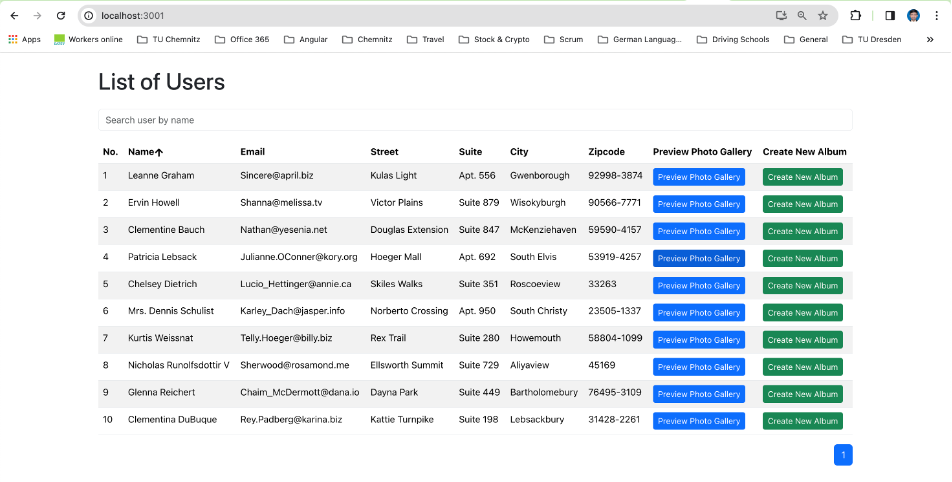
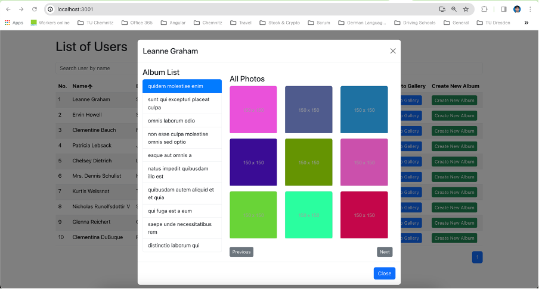
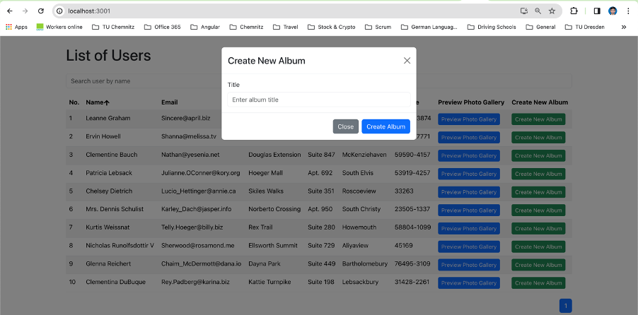

# User Photo Gallery Application

This project is a Album Photo Gallery Application built with TypeScript, BootStrap, NodeJS, React,Jest for unit testing, and Cypress for E2E test.

## Overview

The Photo Gallery Application provides a user-friendly interface for searching the user by user name and see their Albums and the photos in user friendly view.

## Features

- Display all users and their addresses provided by the user API.
- Implement pagination when there are more than ten users.
- Include a textbox to search for users by their usernames.
- Enable filtering of the user table by username in ascending and descending order.
- Allow users to preview photo galleries by clicking a button, displaying the list of albums in a modal. Then, based on each album, show the photos of selected users.
- Implement a "Create New Album" button to create a new album for a user. (Note: The backend accepts the POST request but does not modify anything for now.)
- Ensure adherence to frontend coding standards, including comprehensive component unit tests and end-to-end test cases.

## API used

API of [JSONPlaceholder](https://jsonplaceholder.typicode.com/) is used for change please check the file apiConfig
inside the src/utils folder.

## Installation

To set up the project, follow these steps:

1. Clone the repository from GitHub.

2. Navigate to the Project directory in your terminal.

3. Install dependencies by running:

```
npm install
```

```
npm start
```

4. Start the application with:

This will launch the application in your default web browser at http://localhost:3000

## Testing

1. Navigate to the Project directory in your terminal.

2. To run tests for the components, use the following command:

```
npm test
```

This will execute unit tests for the components using Jest.

## Technologies Used

- React Framework: React was chosen for its efficiency in building interactive user interfaces.
- Component Modularity: - Components were organized into reusable pieces to promote modularity and maintainability.
- Bootstrap CSS for Responsive Design: Bootstrap was implemented to achieve responsive design across different devices.
- The unit testing of components using Jest ensures the robustness and reliability of the application, validating the functionality of component.
- Cypress was chosen to run the end to end test cases.
- All Git and GitLab practices, including branches and merge requests, were followed.

## Learn more from the documentation to create a project

- React: https://reactjs.org
- JSON API Data: https://jsonplaceholder.typicode.com/
- JEST: https://jestjs.io/
- cypress: https://www.cypress.io/
- Git: https://git-scm.com

### `Project UI Images`




